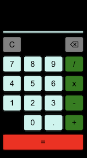
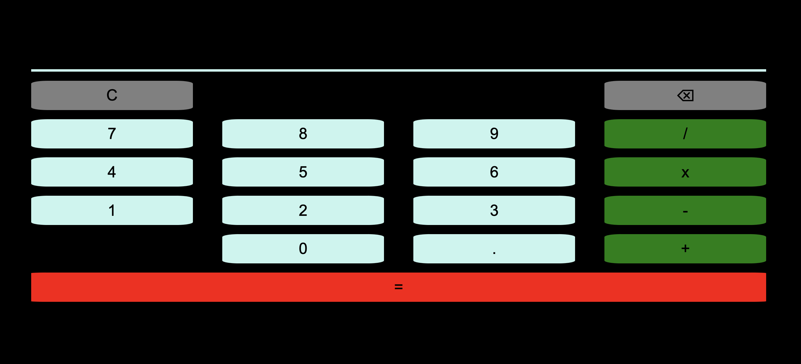

# Calculator

A simple responsive calculator built with JavaScript and math.js.

## Table of Contents

- [Purpose and Goals](#purpose-and-goals)
- [Features](#features)
- [Usage](#usage)
- [License](#license)
- [Screenshots](#screenshots)
- [Future Development](#future-development)
- [Deployed Link](#deployed-link)

## Purpose and Goals

The purpose of this mini-project is to practice javascript, and get more familiar with CSS Grid. 

The main goal is to create a responsive calculator that can compute simple math equations quickly for the user. 

## Features

- The +, -, x, and / operations should all function correctly when solving the equation
- The clear button should clear the display
- The backspace button should remove the previously entered character
- The = button should compute based on the current equation
- The interface should scale based on screen size

## Usage

Either visit [Calculator](https://caitlinw29.github.io/calculator/) in any browser, or fork this repository to use locally or make some changes.

## License

This project is licesensed under the [MIT](https://opensource.org/licenses/MIT) license.

## Screenshots
Mobile View:

Desktop View:

## Future Development
- Improve UI
- If user backspaces right after typing an operation (+, -, x, /), the backspace only deletes one of the added spaces. 
- Parenthesis button
- Light/Dark mode toggle
- Code refactor
- Implement without math.js?
- Adjust scrolling when input is too long...user should see most recently typed characters, not the beginning of the equation

## Deployed Link

See it live: [Calculator](https://caitlinw29.github.io/calculator/)